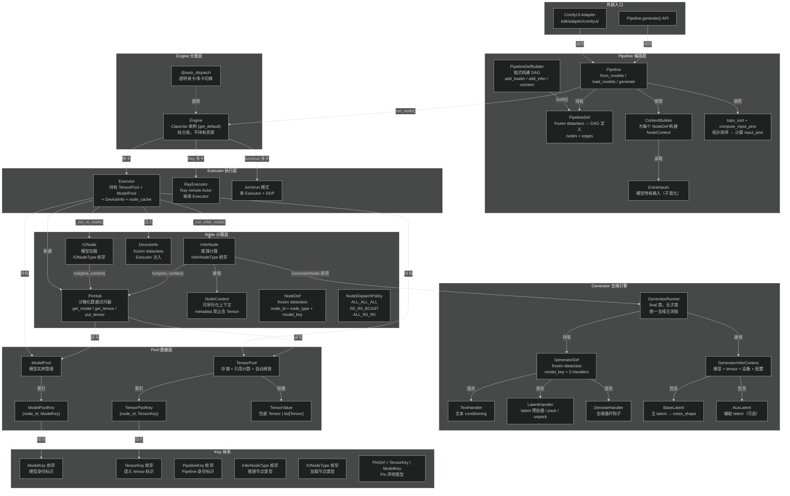

# kDiT 架构总览

## 组件关系图



---

## 数据流

```
Pipeline.generate()
  → DAG topo_sort → 按拓扑序遍历 NodeDef
    → ContextBuilder.build_context(node_def, inputs) → NodeContext
    → compute_input_pins(node_def, edges, all_outputs) → input_pins
    → Engine.run_node(node_def, input_pins, context)
      → Executor.run_node(node_def, input_pins, context)
        → _get_or_create_node(node_def) → IONode | InferNode
        → _build_pin_hub(node_def, input_pins) → PinHub
        → _inject_context_defaults(node_def, context) → DeviceInfo 注入
        → _pre_sync_tensors(node, policy)
        → node.run(pins, context=context)
          → pins.get_tensor() / pins.put_tensor()  ← TensorPool
          → pins.get_model() / pins.put_model()    ← ModelPool
        → _post_sync_tensors(node, node_def, policy)
        → _build_output_pins(node, node_def) → output_pins
        → _consume_input_tensors(input_pins)  ← 引用计数递减
      ← output_pins
    → all_outputs[node_def.node_id] = output_pins
  → engine.get_tensor(TensorKey.VIDEO) → 最终输出
```

---

## Ownership 与状态关系

### 整体 Ownership 层级

```
Engine (singleton via get_default / 或多实例)
 ├── owns: executors
 │    ├── 单卡模式: 1 个 Executor 实例
 │    └── 多卡模式: N 个 RayExecutor (Ray Actor)
 ├── owns: num_gpus, _is_ray, _cleaned_up (引擎级元数据)
 ├── NOT own: model_pool, tensor_pool, device 信息 (这些属于 Executor)
 └── NOT own: 任何 Node 实例 (Node 由 AdvancedFactory 按需创建，用完即弃)

Executor (每卡一个实例)
 ├── owns: model_pool        — ModelPool (存储已加载的模型)
 ├── owns: tensor_pool       — TensorPool (存储推理中间 tensor)
 ├── owns: dist_group        — DistributedGroupManager (管理 torch.distributed)
 ├── owns: device_ctx        — DeviceInfo (frozen dataclass, 只读)
 ├── owns: device / offload_device / device_id (设备信息)
 ├── owns: rank_id / world_size (分布式信息)
 ├── owns: dist_config / shard_fn (分布式配置)
 └── NOT own: Node 实例 (Node 在 run_node 中临时创建)
```

### Engine ([`kdit/engine/engine.py`](../../kdit/engine/engine.py))

| 属性 | 类型 | 说明 |
|------|------|------|
| `executors` | `Executor` 或 `list[RayExecutor]` | **唯一核心持有物**。单卡时是一个实例，多卡时是 Ray Actor 列表 |
| `num_gpus` | `int` | GPU 数量，从 dist_config 复制 |
| `_is_ray` | `bool` | 是否使用 Ray 分布式 |
| `_cleaned_up` | `bool` | 清理标记，防止重复清理 |

**Engine 不持有**：model_pool、tensor_pool、device 信息、Node 实例。Engine 是纯粹的**分发层**，所有实际资源都在 Executor 上。

### Engine 公开 API（桥接方法，透传到 Executor）

| 方法 | 用途 | 说明 |
|------|------|------|
| `engine.run_node()` | 执行 Node | 分发到所有 Executor，**返回 `output_pins`**。Ray 模式取 rank 0 结果 |
| `engine.get_tensor(key)` | 取回 TensorValue | 自动从 rank 0 取，返回 `TensorValue`（需 `.data` 取裸 tensor） |
| `engine.put_tensors(tensors)` | 写入 tensor | 写入所有 Executor 的 tensor_pool，自动包装为 `TensorValue` |
| `engine.has_tensor(key)` | 检查 key 存在性 | 检查 rank 0 的 tensor_pool 中是否存在指定 key |
| `engine.register_tensor(pool_key, ref_count)` | 注册引用计数 | 透传到所有 Executor 的 tensor_pool.register() |
| `engine.clear_all_tensors()` | 清理所有 tensor | 清理所有 Executor 的 tensor_pool — 用于 try/finally 异常恢复 |
| `engine.rename_tensor(old, new)` | 重命名 key | 透传到所有 Executor 的 tensor_pool.rename() |

> **`tensor_scope` 已删除**。异常安全通过 `try/finally + engine.clear_all_tensors()` 实现。
> TensorPool 内置引用计数（register/consume）自动管理中间 tensor 的释放。

### Executor ([`kdit/executor/executor.py`](../../kdit/executor/executor.py))

| 属性 | 类型 | 生命周期 | 说明 |
|------|------|---------|------|
| `model_pool` | `ModelPool` | 与 Executor 同生命周期 | 存储所有已加载模型，按 `ModelKey` 索引 |
| `tensor_pool` | `TensorPool` | 每次推理结束时 clear（Pipeline 用 try/finally） | 存储推理中间 tensor，内置引用计数 |
| `dist_group` | `DistributedGroupManager` | 与 Executor 同生命周期 | 管理 broadcast 等分布式操作 |
| `device_ctx` | `DeviceInfo` | 初始化后不变（frozen） | 只读设备上下文，传入 Node.run() |
| `device` | `torch.device` | 不变 | 计算设备 (如 `cuda:0`) |
| `offload_device` | `torch.device` | 不变 | 卸载设备 (如 `cpu`) |
| `dist_config` | `DistributedConfig` | `init_torch_dist_group()` 后更新 | 分布式配置 |
| `shard_fn` | `partial` 或 `None` | `init_torch_dist_group()` 后设置 | FSDP 分片函数 |

### Executor 同步机制

`Executor.run_node()` 负责：

1. **`_pre_sync_tensors()`**: 执行前的 tensor 同步（预留接口，未来可自动 broadcast 输入）
2. **`is_active_rank`**: 根据 policy 判断当前卡是否执行 `run()`
3. **`_post_sync_tensors()`**: 执行后的 tensor 同步（`R0_R0_BCAST` 时 broadcast `output_defs` 中的 key）
4. **`_consume_input_tensors()`**: 自动消费输入 tensor 引用计数

Node 内部不需要感知多卡逻辑，Executor 负责所有 tensor 的 pre/post 同步和引用计数管理。

---

## 关键设计决策

1. **Engine 是纯分发层**：不持有 model_pool / tensor_pool / device 信息，所有资源在 Executor 上
2. **多卡模式**：优先检测 torchrun 环境，否则使用 Ray。Engine 透明切换
3. **Generator 是 InferNode 的内部子系统**：`GeneratorNode.run()` 内部构建 `GeneratorInferContext`，调用 `GeneratorRunner.run(ctx)` 执行去噪
4. **Adapter 依赖方向**：`kdit/adapter/comfyui/` → `kdit/` ✅；反向 ❌ 禁止
5. **Node 通过 PinHub 沙箱访问数据**：禁止直接操作 TensorPool / ModelPool
6. **NodeContext 可序列化**：metadata 禁止含 `torch.Tensor`，保证跨 Ray 边界安全

### 设计约束总结

| 约束 | 说明 |
|------|------|
| Engine 不持有资源 | Engine 只是分发层，所有实际资源（model_pool, tensor_pool, device）在 Executor 上 |
| Executor 持有所有资源 | model_pool + tensor_pool + dist_group + device_ctx + node_cache |
| Node 无状态（理想） | InferNode 完全无状态；IONode 中 `DiffusionLoaderNode` 有类级 `_pinned_memory_manager` 例外 |
| DeviceInfo 只读 | `frozen=True` dataclass，Node 无法篡改 |
| NodeContext 无 tensor | `__post_init__` 强制校验不含 `torch.Tensor`，保证可跨 Ray 序列化 |
| tensor_pool 生命周期 | Pipeline 用 `try/finally + clear_all_tensors()`；DAG 模式下引用计数自动释放 |
| model_pool 生命周期 | 与 Executor 同生命周期，需手动 `clear_models()` 释放 |
| InferNode.run() 签名固定 | `(self, pins: PinHub, *, context: NodeContext) -> None`，禁止扩展 |
| Tensor 只能通过 PinHub 流转 | 禁止在 run() 参数或 context.metadata 中传递 tensor |

---

## 子系统文档

| 子系统 | 文档 |
|--------|------|
| Pipeline 编排层 | [`pipeline.md`](pipeline.md) |
| Generator 去噪引擎 | [`generator.md`](generator.md) |
| Node 计算单元 | [`node.md`](node.md) |
| PinHub 沙箱 | [`pin-hub.md`](pin-hub.md) |
| NodeContext | [`node-context.md`](node-context.md) |
| Pool / PoolKey | [`pool-key.md`](pool-key.md) |
| Key 类型体系 | [`../03_standards/key-system.md`](../03_standards/key-system.md) |
| Adapter 规范 | [`adapter.md`](adapter.md) |
| 设备信息 | [`device-info.md`](device-info.md) |
| 编码实操规范 | [`../03_standards/node-and-tensor.md`](../03_standards/node-and-tensor.md) |
