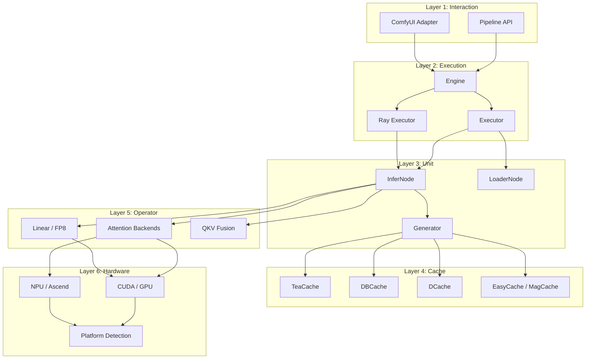
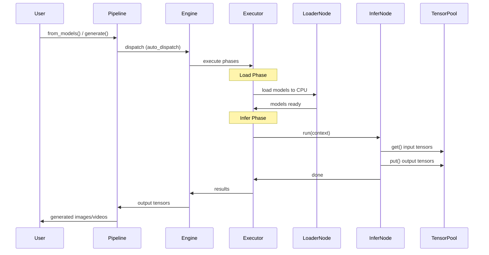

# Architecture Overview

kDiT adopts a **6-layer modular architecture** designed for high-performance DiT inference with maximum flexibility and extensibility.

## Layer Diagram



## Layer Details

### Layer 1: Interaction (交互层)

The entry point for users. Two modes are supported:

| Component | Description |
|-----------|-------------|
| [`Pipeline`](api/pipeline/pipeline.md) | Python API — `Pipeline.from_models()` auto-detects model type and builds the inference pipeline |
| ComfyUI Adapter | 32 custom nodes for visual workflow design in ComfyUI |

### Layer 2: Execution (执行层)

Manages the lifecycle of inference, including single-GPU and multi-GPU (Ray) execution.

| Component | Description |
|-----------|-------------|
| [`Engine`](api/engine.md) | Thread-safe singleton via `get_default()`. Orchestrates load → infer → output |
| [`Executor`](api/executor/executor.md) | Local single-process executor. Manages model loading, tensor sync, and node dispatch |
| [`RayExecutor`](api/executor/ray_executor.md) | Ray-based distributed executor for multi-GPU inference |

### Layer 3: Unit (单元层)

The building blocks of inference pipelines.

| Component | Description |
|-----------|-------------|
| [`InferNode`](api/nodes/core.md) | Base class for inference nodes. Fixed `run()` signature; data flows via `TensorPool` |
| [`LoaderNode`](api/nodes/loaders.md) | Nodes responsible for loading models (diffusion, text encoder, VAE) |
| [`Generator`](api/generators/index.md) | Denoising loop implementations (Wan, Qwen, VACE) |

### Layer 4: Cache (缓存层)

Step-level caching strategies to skip redundant computation during denoising.

| Component | Description |
|-----------|-------------|
| [`TeaCache`](api/cache/teacache.md) | Temporal-Error-Aware cache |
| [`DBCache`](api/cache/dbcache.md) | Delta-Based cache |
| [`DCache`](api/cache/dcache.md) | D-Cache implementation |
| [`EasyCache`](api/cache/easycache.md) | Lightweight step cache |
| [`MagCache`](api/cache/magcache.md) | Magnitude-based cache |

### Layer 5: Operator (算子层)

Low-level compute primitives with multiple backend support.

| Component | Description |
|-----------|-------------|
| [Attention](api/operations/attention.md) | FlashAttention, SageAttention, SDPA, Radial-SageAttention backends |
| [Linear](api/operations/linear.md) | Standard and FP8 linear backends |
| [QKV Fusion](api/operations/fuse_qkv.md) | Fused QKV projection (auto-disabled when FP8 is active) |

### Layer 6: Hardware (硬件层)

Platform abstraction for GPU and NPU.

| Component | Description |
|-----------|-------------|
| [Accelerator](api/accelerator.md) | Platform detection (`is_npu()`, `is_gpu()`), dtype normalization |
| CUDA/GPU | NVIDIA GPU via NCCL |
| NPU/Ascend | Huawei Ascend via HCCL + `torch_npu` |

## Data Flow



## Key Design Patterns

### Declarative Pipeline Definition

Pipelines are defined as immutable `PipelineDef` data structures using `PipelineDefBuilder`:

```python
PipelineDefBuilder("wan_t2v") \
    .load(LoadTask.TEXT_ENCODER, ...) \
    .load(LoadTask.DIFFUSION_MODEL, ...) \
    .load(LoadTask.VAE, ...) \
    .infer(InferTask.TEXT_ENCODE, ...) \
    .infer(InferTask.GENERATE, ...) \
    .infer(InferTask.VAE_DECODE, ...) \
    .build()
```

### Node Dispatch Policy

Nodes declare their multi-GPU behavior via `NodeDispatchPolicy`:

| Policy | Input | Exec | Output | Use Case |
|--------|-------|------|--------|----------|
| `ALL_ALL_ALL` | All ranks | All ranks | All ranks | Independent per-GPU work |
| `R0_R0_BCAST` | Rank 0 | Rank 0 | Broadcast | Text encoding (run once, share) |
| `ALL_R0_R0` | All ranks | Rank 0 | Rank 0 only | Save/output on rank 0 |

### TensorPool

All tensor data flows through `TensorPool` using `TensorKey` enums — never passed via function arguments or metadata.

### Generator Latent Semantics

Generator inputs are split into two categories:

- **BaseLatent** — The primary latent that determines `noise_shape` (i.e., the output dimensions). For video generation, it controls resolution and duration; for image generation, it controls resolution. `noise_shape` is derived from `base_latent.latent.shape[1:]`. Most models use an empty latent (via `torch.zeros`) to define the shape; only WAN I2V and its derivative VACE pass a non-None `mask` alongside the latent.

- **AuxLatent** — An optional auxiliary latent input. It can be any tensor or list of tensors, and each model subclass decides how to use it. For example, Qwen uses it as reference image embeddings (`ref_latents`), while WAN uses it for noise blending.

See the [Generators API](api/generators/index.md) for details on per-model behavior.
