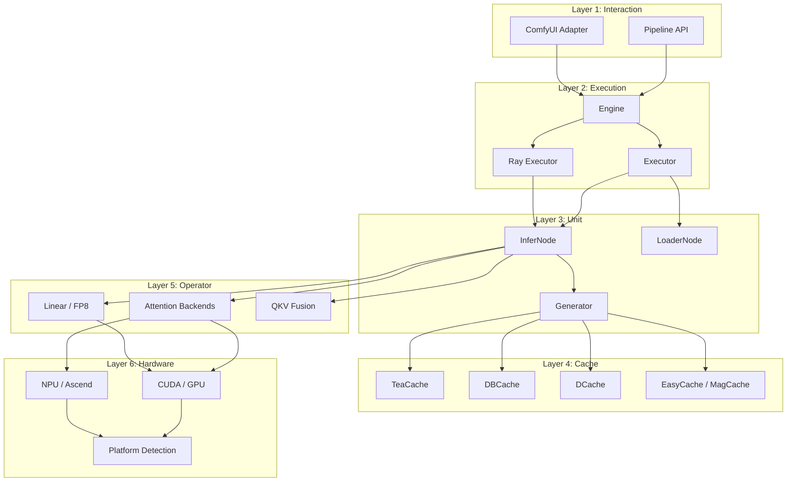
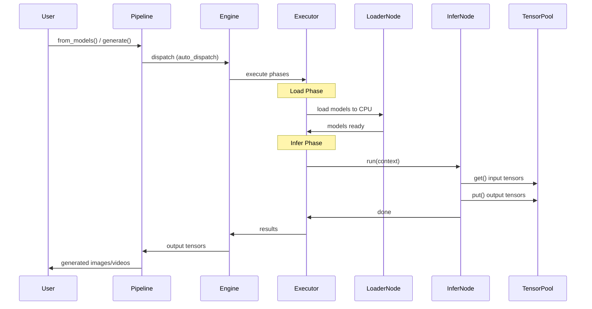

# 架构概览

kDiT 采用 **6 层模块化架构**，专为高性能 DiT 推理设计，兼顾最大灵活性和可扩展性。

## 层次图



## 各层详解

### 第 1 层：交互层 (Interaction)

用户入口，支持两种使用模式：

| 组件 | 说明 |
|------|------|
| [`Pipeline`](api/pipeline/pipeline.md) | Python API — `Pipeline.from_models()` 自动检测模型类型并构建推理流水线 |
| ComfyUI Adapter | 32 个自定义节点，支持 ComfyUI 可视化工作流设计 |

### 第 2 层：执行层 (Execution)

管理推理生命周期，包括单 GPU 和多 GPU（Ray）执行。

| 组件 | 说明 |
|------|------|
| [`Engine`](api/engine.md) | 线程安全单例，通过 `get_default()` 获取。编排 加载 → 推理 → 输出 |
| [`Executor`](api/executor/executor.md) | 本地单进程执行器。管理模型加载、张量同步和节点调度 |
| [`RayExecutor`](api/executor/ray_executor.md) | 基于 Ray 的分布式执行器，支持多 GPU 推理 |

### 第 3 层：单元层 (Unit)

推理流水线的构建模块。

| 组件 | 说明 |
|------|------|
| [`InferNode`](api/nodes/core.md) | 推理节点基类。固定 `run()` 签名；数据通过 `TensorPool` 流转 |
| [`LoaderNode`](api/nodes/loaders.md) | 负责加载模型（扩散模型、文本编码器、VAE）的节点 |
| [`Generator`](api/generators/index.md) | 去噪循环实现（Wan、Qwen、VACE） |

### 第 4 层：缓存层 (Cache)

步级缓存策略，跳过去噪过程中的冗余计算。

| 组件 | 说明 |
|------|------|
| [`TeaCache`](api/cache/teacache.md) | 时序误差感知缓存 |
| [`DBCache`](api/cache/dbcache.md) | 基于增量的缓存 |
| [`DCache`](api/cache/dcache.md) | D-Cache 实现 |
| [`EasyCache`](api/cache/easycache.md) | 轻量级步缓存 |
| [`MagCache`](api/cache/magcache.md) | 基于幅度的缓存 |

### 第 5 层：算子层 (Operator)

底层计算原语，支持多后端。

| 组件 | 说明 |
|------|------|
| [注意力](api/operations/attention.md) | FlashAttention、SageAttention、SDPA、Radial-SageAttention 后端 |
| [线性层](api/operations/linear.md) | 标准和 FP8 线性后端 |
| [QKV 融合](api/operations/fuse_qkv.md) | 融合 QKV 投影（FP8 激活时自动禁用） |

### 第 6 层：硬件层 (Hardware)

GPU 和 NPU 的平台抽象。

| 组件 | 说明 |
|------|------|
| [加速器](api/accelerator.md) | 平台检测（`is_npu()`、`is_gpu()`）、dtype 归一化 |
| CUDA/GPU | NVIDIA GPU，通过 NCCL 通信 |
| NPU/Ascend | 华为昇腾，通过 HCCL + `torch_npu` |

## 数据流



## 核心设计模式

### 声明式 Pipeline 定义

Pipeline 通过 `PipelineDefBuilder` 定义为不可变的 `PipelineDef` 数据结构：

```python
PipelineDefBuilder("wan_t2v") \
    .load(LoadTask.TEXT_ENCODER, ...) \
    .load(LoadTask.DIFFUSION_MODEL, ...) \
    .load(LoadTask.VAE, ...) \
    .infer(InferTask.TEXT_ENCODE, ...) \
    .infer(InferTask.GENERATE, ...) \
    .infer(InferTask.VAE_DECODE, ...) \
    .build()
```

### 节点调度策略

节点通过 `NodeDispatchPolicy` 声明其多 GPU 行为：

| 策略 | 输入 | 执行 | 输出 | 使用场景 |
|------|------|------|------|----------|
| `ALL_ALL_ALL` | 所有卡 | 所有卡 | 所有卡 | 各 GPU 独立工作 |
| `R0_R0_BCAST` | Rank 0 | Rank 0 | 广播 | 文本编码（执行一次，共享结果） |
| `ALL_R0_R0` | 所有卡 | Rank 0 | 仅 Rank 0 | 在 Rank 0 上保存/输出 |

### TensorPool

所有张量数据通过 `TensorPool` 使用 `TensorKey` 枚举流转 — 禁止通过函数参数或 metadata 传递张量。

### Generator Latent 语义

Generator 的输入 latent 分为两类：

- **BaseLatent** — 主 latent，决定 `noise_shape`（即输出尺寸）。对于视频生成，控制分辨率和时长；对于图片生成，控制分辨率。`noise_shape` 从 `base_latent.latent.shape[1:]` 推导。大多数模型通过空 latent（`torch.zeros`）来定义 shape；只有 WAN I2V 及其衍生的 VACE 会在 latent 旁传入非 None 的 `mask`。

- **AuxLatent** — 可选的辅助 latent 输入，可以是任意 tensor 或 list[tensor]，由模型子类自行决定如何使用。例如 Qwen 用作参考图片 embedding（`ref_latents`），WAN 用于噪声混合。

详见 [生成器 API](api/generators/index.zh.md) 了解各模型的具体行为。
